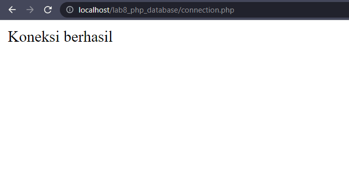
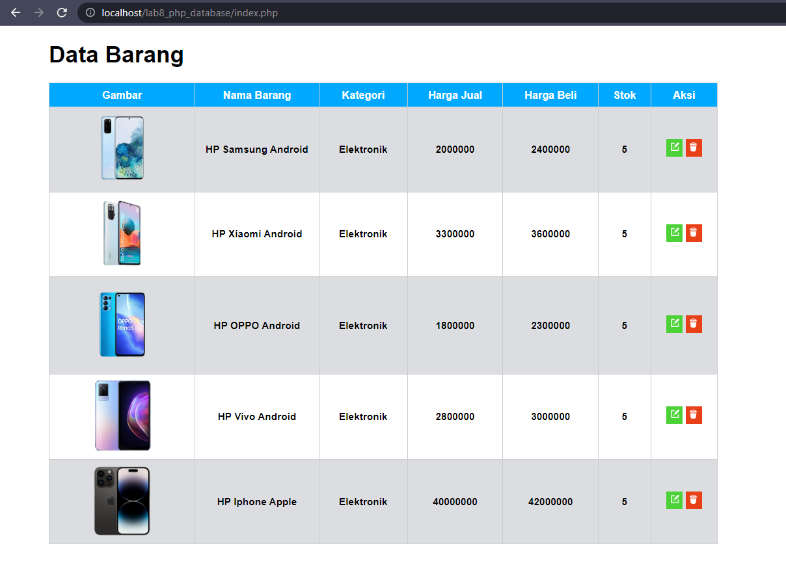
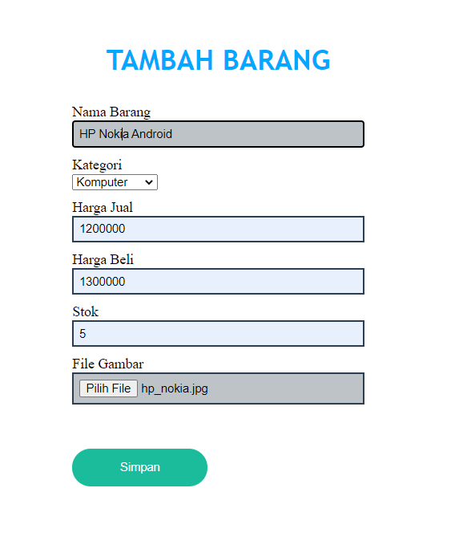
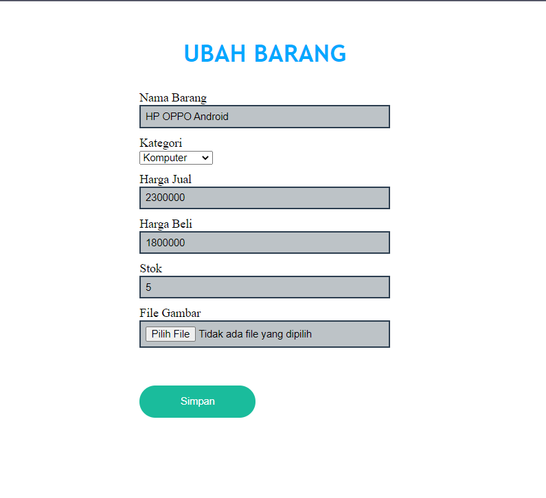
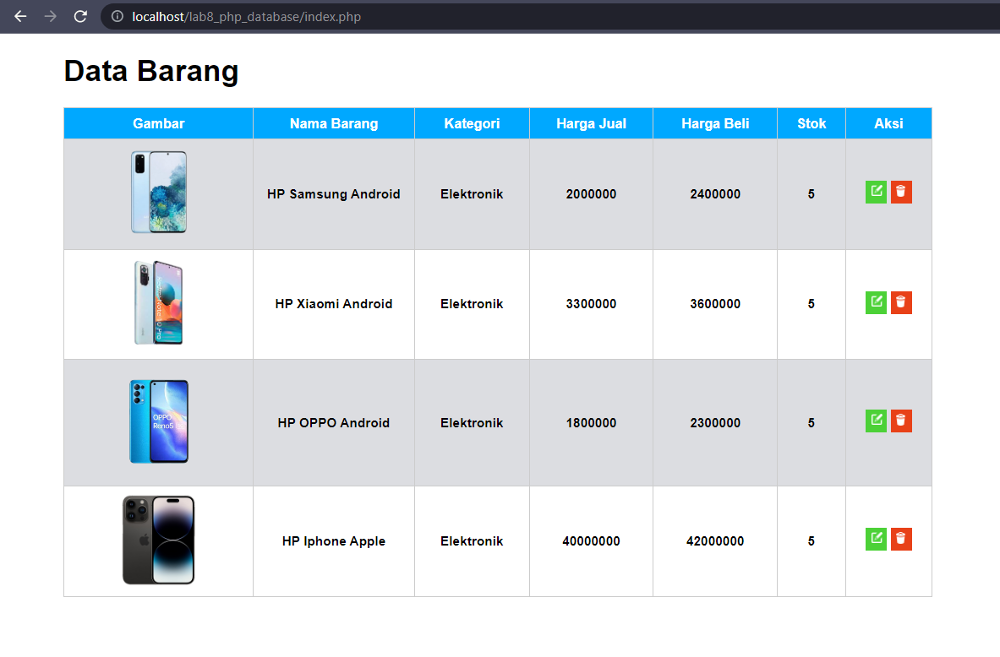

# TUGAS Lab3 PHP Database Pemograman Web 2

# Nama : Zaini Muhtarom
# NIM  : 312110294
# Kelas    : TI . 21 . A3
# Mata Kuliah  : Pemograman Web 2

### **hasil file connection.php**

  

### **Penjelasan**
>Hasil diatas merupakan tampilan yaitu menghubungkan Table PHP dengan MYSQL Database PHPMYADMIN

### **hasil file index.php**

  

### **Penjelasan**
>Hasil diatas merupakan tampilan yaitu Table HTML dengan menggunakan Database PHP

### **hasil file plus.php**

  

### **Penjelasan**
>Hasil diatas merupakan tampilan yaitu untuk menambahkan barang ke Database PHP

### **hasil file update.php**

  

### **Penjelasan**
>Hasil diatas merupakan tampilan yaitu untuk mengubah barang ke Database PHP

### **hasil file delete.php**

  

### **Penjelasan**
>Hasil diatas merupakan tampilan yaitu untuk menghapus barang yang terdapat tabel HTML yang terhubung dengan Database

